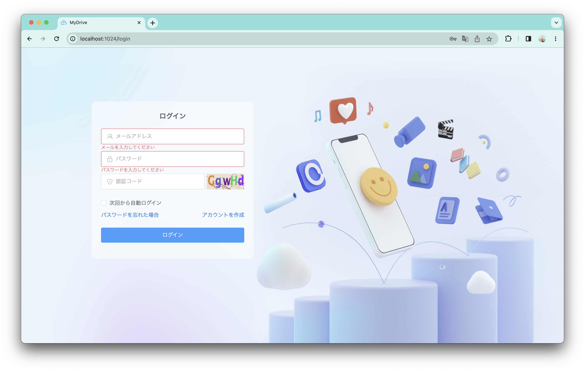
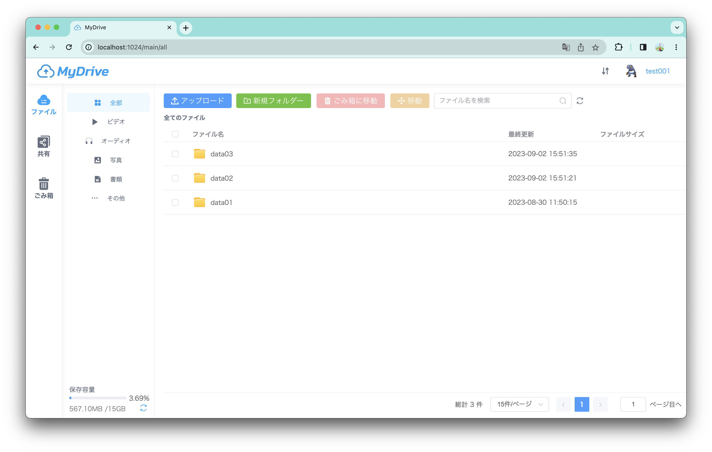
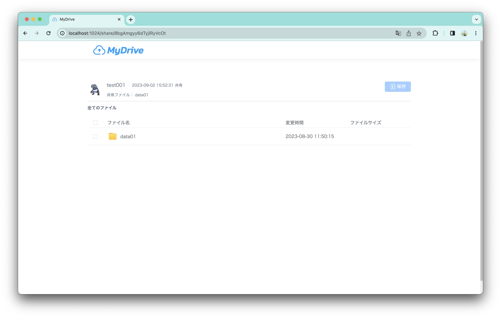

# :floppy_disk: MyDrive: Spring Bootで実装されたクラウドドライブシステム


## :wrench: 技術スタック
| Tools      | version |
| ---------- | ------- |
| JDK        | 1.8     |
| Maven      | 3.9.4   |
| SpringBoot | 2.6.1   |
| node       | 16.20   |
| Vue        | 3.3.4   |
| MySQL      | 8.0.29  |
| Redis      | 7.0     |
| ffmpeg     | 6.0     |

## 使用説明
### パッケージ
```
cd mydrive
mvn clean package
```
### バックエンド起動
```
// go to target folder
java -jar MyDrive-1.0-SNAPSHOT.jar
```
バックエンドは http://localhost:8080 で実行されます

### フロントエンド起動
ソースコード： [mydrive-front](https://github.com/imelolee/mydrive-front) 
```
cd mydrive-front
npm install
npm run dev
```
フロントエンは http://localhost:1024 で実行されます
  
- ログイン


- ホームページ


- 共有
